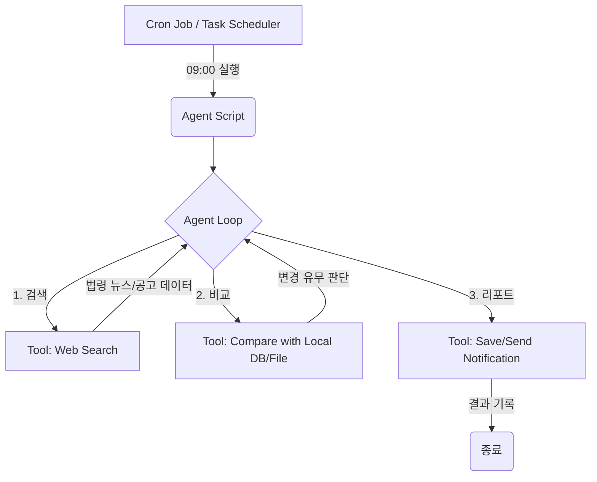

# 🧪 화학물질법령 모니터링 에이전트 구축 가이드

매일 아침 09:00에 최신 화학물질법령을 조사하고, 변경 사항을 리포트하는 에이전트의 설계도입니다.

## 1. 전체 구조 (System Architecture)



---

## 2. 핵심 구성 요소 (Key Components)

### A. 툴 (Tools) 정의
에이전트가 사용할 '손과 발'입니다.
1.  **`search_chemical_laws`**: 국가법령정보센터나 관련 뉴스 사이트를 검색하여 최신 데이터를 가져옵니다.
2.  **`check_previous_state`**: 로컬에 저장된 '어제의 법령 상태' 파일이나 DB를 읽어옵니다.
3.  **`save_daily_report`**: 오늘의 조사 결과를 Markdown 파일이나 로그로 저장합니다.

### B. 에이전트 페르소나 (Instruction)
LLM에게 부여할 역할입니다.
> "너는 화학물질 규제 전문 조사관이야. 오늘 날짜의 법령 변화를 조사하고, 특히 '유해화학물질 관리'와 관련된 조항에 변경이 있는지 중점적으로 확인해."

---

## 3. 단계별 구현 계획 (Step-by-step)

### 1단계: 도구(Tool) 구현
가장 먼저 LLM 없이 작동하는 순수 Python 함수를 만듭니다.
```python
@tool
def get_law_updates(query: str) -> str:
    """최신 화학물질법령 업데이트 정보를 검색합니다."""
    # Tavily, Google Search API 또는 국가법령정보센터 크롤러 로직
    return "2026-04-27일자 유독물질 지정 고시 일부 개정 안내..."
```

### 2단계: 에이전트 로직 작성
LangChain의 `create_tool_calling_agent`를 사용하여 루프를 구성합니다. 
- 현재 날짜 정보를 시스템 프롬프트에 포함시키는 것이 중요합니다.

### 3단계: 스케줄러 등록 (Windows 기준)
개발자님의 PC에서 매일 아침 실행되도록 설정합니다.
1.  `Task Scheduler` 실행
2.  새 작업 만들기 -> 트리거: 매일 09:00
3.  동작: 프로그램 시작 -> `python.exe`
4.  인수: `C:\path\to\your\agent_script.py`

---

## 4. 확장 아이디어 (Skills & MCP)
- **MCP 연결**: 법령 데이터를 가지고 있는 사내 DB가 있다면 MCP 서버로 노출하여 에이전트가 직접 쿼리하게 할 수 있습니다.
- **슬랙 알림**: 변경 사항 발견 시 개발팀 슬랙 채널에 `Incoming Webhook`으로 즉시 전송하는 툴을 추가합니다.
